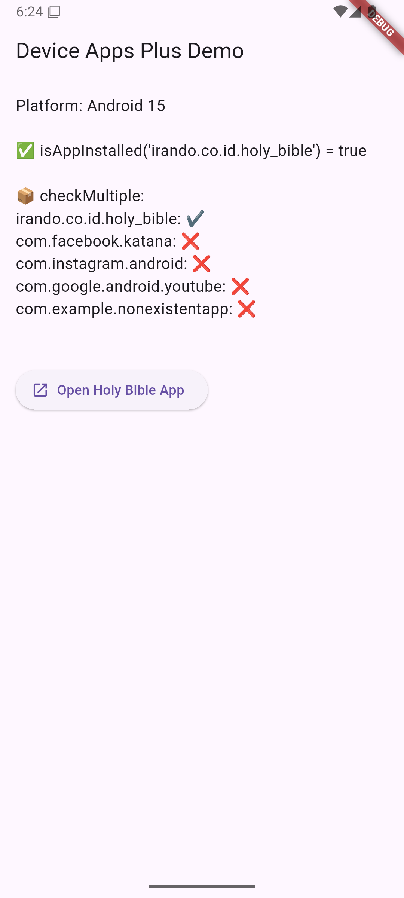

# 📱 Device Apps Plus

A Flutter plugin to check whether specific Android apps are installed on the user's device.

- ✅ Supports Android SDK 21 and above
- ❌ Not supported on iOS (`UnsupportedError` will be thrown)



---

## 🔧 Features

- `isAppInstalled(String packageName)` – Check if a specific app is installed
- `checkMultiple(List<String> packageNames)` – Efficiently check multiple apps at once

---

## 🚀 Getting Started

### 1. Add Dependency

In your app's `pubspec.yaml`:

```yaml
dependencies:
  device_apps_plus: ^1.0.0
```

### 2. Use the Plugin

```dart
import 'package:device_apps_plus/device_apps_plus.dart';

final checker = DeviceAppsPlus();

// Single app
bool installed = await checker.isAppInstalled("irando.co.id.holy_bible");

// Multiple apps
final results = await checker.checkMultiple([
  "irando.co.id.holy_bible",
  "com.facebook.katana",
  "com.instagram.android",
  "com.nonexistent.app",
]);

results.forEach((pkg, isInstalled) {
  print('$pkg: ${isInstalled ? "Installed" : "Not Installed"}');
});
```

---

## ⚠️ Android Manifest Setup

To support app queries on Android 11+ (API 30+), add the following to your `AndroidManifest.xml`:

```xml
<manifest ...>
  <queries>
    <package android:name="irando.co.id.holy_bible" />
    <package android:name="com.facebook.katana" />
    <package android:name="com.instagram.android" />
    <!-- Add any other packages your app checks for -->
  </queries>
</manifest>
```

📖 This is required due to [Android package visibility restrictions](https://developer.android.com/training/basics/intents/package-visibility) introduced in API 30.

---

## 📦 Platform Support

| Platform | Support         |
|----------|-----------------|
| Android  | ✅ SDK 21–36     |
| iOS      | ❌ Not supported |

---

## 🧪 Example Output

```
Platform: Android 14

✅ isAppInstalled('irando.co.id.holy_bible') = true

📦 checkMultiple:
irando.co.id.holy_bible: ✔️
com.facebook.katana: ❌
com.instagram.android: ✔️
com.nonexistent.app: ❌
```

---

## 📄 License

MIT

---

## 🔗 Resources

- [PT. Nicxon International Solutions](https://nicxonsolutions.com)
